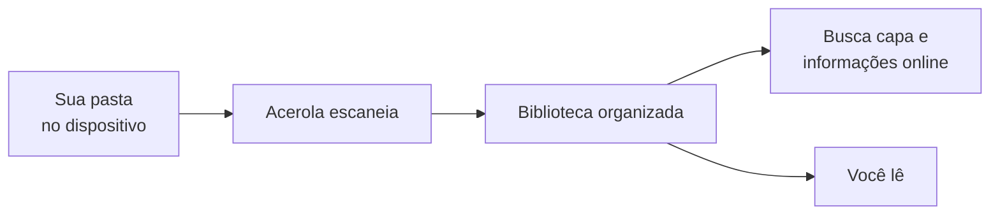
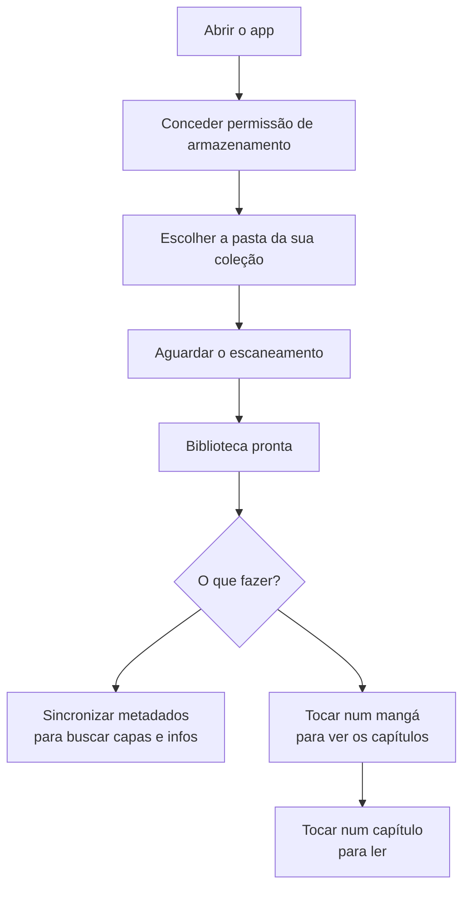

# Acerola

Acerola é um leitor de mangá para Android focado em coleções locais. Você aponta para uma pasta no seu dispositivo, o app encontra os arquivos e monta sua biblioteca automaticamente.

---

## O que o app faz

 

Você tem arquivos `.cbz`, `.cbr` ou `.pdf` no seu celular. O Acerola escaneia a pasta que você escolher, organiza tudo em uma biblioteca e busca as informações do mangá (capa, autor, gênero, sinopse) automaticamente na internet.

---

## Funcionalidades

### Biblioteca

- Escaneia pastas do dispositivo e detecta novos arquivos automaticamente
- Exibe os mangás em grade ou lista
- Busca por título
- Organização por categorias
- Esconde mangás que você não quer ver na biblioteca

### Metadados

- Busca capa, sinopse, autor e gênero automaticamente
- Fontes disponíveis: MangaDex, AniList ou ComicInfo (metadado embutido no próprio arquivo)
- Você pode trocar a fonte de metadados por mangá
- Troca capa e banner manualmente se quiser

### Leitura

- Abre capítulos diretamente dos arquivos `.cbz` e `.cbr`
- Arquivos `.pdf` são convertidos automaticamente para `.cbz` antes da leitura
- Paginação configurável
- Salva o progresso de leitura automaticamente

**Histórico**
- Mostra os mangás que você leu recentemente com o capítulo em que parou

### Temas

- Catppuccin (claro e escuro), Dracula, Alucard, Nord (claro e escuro)

---

## Como usar

1. Na primeira abertura, conceda permissão de acesso ao armazenamento.
2. Configure a pasta onde seus mangás estão.
3. O app escaneia e monta a biblioteca.
4. Sincronize os metadados para o app buscar as informações online.
5. Leia.

---

## Formatos suportados

| Formato | Descrição |
|---------|-----------|
| `.cbz` | Comic Book ZIP — arquivo zip com imagens dentro |
| `.cbr` | Comic Book RAR — arquivo rar com imagens dentro |
| `.pdf` | Convertido automaticamente para `.cbz` na primeira leitura |
